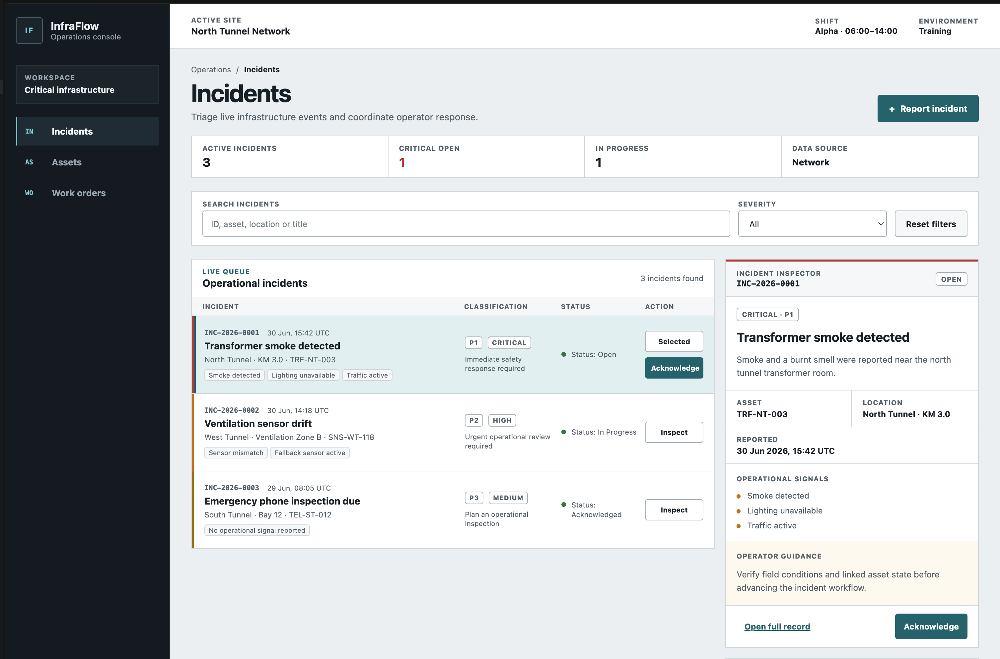
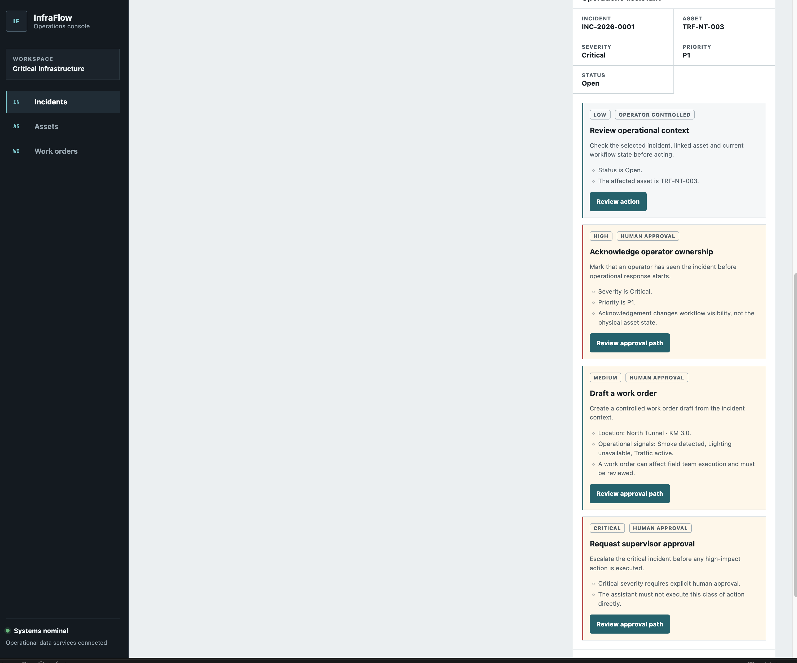

# InfraFlow Platform

[](https://github.com/mrozmen7/infraflow-platform/actions/workflows/frontend-ci.yml)
[](https://github.com/mrozmen7/infraflow-platform/actions/workflows/backend-ci.yml)

InfraFlow is a modular operations platform for critical infrastructure teams. It
coordinates incident triage, asset context and work-order workflows through a modern
Angular frontend, a Spring Boot modular monolith backend and a PostgreSQL persistence
layer.

The system demonstrates domain-driven API design, signal-based frontend state and
contract-first integration: the backend publishes an OpenAPI contract from which the
Angular API client is generated, JWT-secured workflows with refresh-token rotation,
transaction-safe audit logging, optimistic concurrency control, paginated incident
search and a German/English user interface.

## Architektur- und Sicherheitsüberblick

- **Stack:** Angular 22 (Standalone Components, Signals), Spring Boot 3.5 / Java 21
  als modularer Monolith, PostgreSQL mit Flyway-Migrationen.
- **Modulgrenzen:** Fachmodule `incidents`, `assets`, `workorders` und `agentic` mit
  den Schichten domain/application/infrastructure/web; modulübergreifende Zugriffe
  nur über Application-Ports, durch ArchUnit-Tests erzwungen (ADR 0007).
- **Sicherheit:** JWT-Zugangstoken (15 Minuten) mit HttpOnly-Refresh-Rotation und
  Wiederverwendungserkennung, rollenbasierte Autorisierung (`OPERATOR`/`ADMIN`),
  Geheimnisse ausschliesslich über Umgebungsvariablen (`JWT_SECRET`, DB-Zugangsdaten).
- **Qualitätsgates:** 57 Backend-Tests (inkl. Testcontainers-PostgreSQL), 115
  Frontend-Unit-Tests, Architektur- und Guardrail-Prüfungen, Abgleich des generierten
  API-Clients mit dem OpenAPI-Vertrag, Playwright-Browserflüsse, drei CI-Workflows.

## Product scope

InfraFlow supports operators who need to react to infrastructure incidents without
losing operational context:

- monitor active incidents across tunnel and infrastructure assets
- maintain a searchable asset registry as the operational source of truth for equipment context
- filter and inspect incident severity, priority, status and operational signals
- acknowledge operator ownership before response coordination starts
- draft and inspect work orders derived from verified incident context
- expose a stable OpenAPI contract for frontend/backend integration

## Screenshots

### Incident operations console



### Guided incident action panel



## Architecture

```text
infraflow-platform/
├── frontend/      Angular operations console
├── backend/       Spring Boot modular monolith API
├── contracts/     OpenAPI and integration contracts
├── infra/         Local infrastructure definitions
├── docs/          Architecture, domain and delivery documentation
└── AGENTS.md      AI-assisted development operating rules
```

### Frontend

- Angular 22
- Standalone components
- Signals, computed state and resource-style loading flows
- Route-scoped feature boundaries
- Signal Store, normalized state and rollback-safe optimistic updates
- German/English i18n (`@ngx-translate`), German default, persisted language preference
- Typed API client generated from the OpenAPI contract (`ng-openapi-gen`)
- Strict TypeScript, accessibility checks and architecture guardrails

```text
frontend/src/app/
├── core/              application-wide configuration and shell concerns
├── shared/ui/         domain-independent reusable UI
└── features/
    ├── incidents/     incident triage and workflow slice
    ├── assets/        asset-registry read-model slice
    └── work-orders/   controlled maintenance workflow slice
```

### Backend

- Java 21
- Spring Boot 3.5
- Modular monolith package structure
- Spring MVC REST API
- Bean Validation and standardized error responses
- Spring Data JPA
- PostgreSQL
- Flyway migrations
- Transaction boundaries in application services
- Spring Security JWT authentication
- Role-based authorization with `OPERATOR` and `ADMIN`
- Optimistic locking for concurrent incident updates
- Transaction-safe audit logging for rejected workflow commands
- Explicit query fetch boundaries for N+1 prevention
- Paginated incident search (`page`/`size`/`sort`) backed by database queries
- Prometheus metrics endpoint and structured JSON logging
- OpenAPI/Swagger contract generation with stable operation ids

```text
backend/src/main/java/com/infraflow/platform/
├── incidents/
│   ├── domain
│   ├── application
│   ├── infrastructure
│   └── web
├── assets/
│   ├── domain
│   ├── application
│   ├── infrastructure
│   └── web
├── workorders/
│   ├── domain
│   ├── application
│   ├── infrastructure
│   └── web
└── shared/
    ├── audit
    ├── config
    ├── error
    └── security
```

## API contract

The current REST API contract is exported to:

```text
contracts/openapi/infraflow-api-v1.openapi.json
```

Main endpoints:

- `POST /api/v1/auth/login`
- `POST /api/v1/auth/refresh`
- `GET /api/v1/incidents`
- `GET /api/v1/incidents/{incidentId}`
- `POST /api/v1/incidents`
- `POST /api/v1/incidents/{incidentId}/acknowledge`
- `POST /api/v1/incidents/{incidentId}/start-response`
- `POST /api/v1/incidents/{incidentId}/resolve`
- `GET /api/v1/assets`
- `GET /api/v1/assets/{assetId}`
- `GET /api/v1/work-orders`
- `GET /api/v1/work-orders/{workOrderId}`
- `POST /api/v1/work-orders/drafts`
- `GET /v3/api-docs`
- `GET /swagger-ui.html`

Authorization model:

- `OPERATOR`: read queues, report incidents, acknowledge and start response workflows
- `ADMIN`: all operator capabilities plus incident resolution
- stale writes return conflict semantics through JPA optimistic locking
- rejected workflow commands are still recorded in the audit log

## Local setup

Requirements:

- Node.js 24.15.0
- npm 11.6 or compatible
- Java 21
- Docker Desktop or compatible Docker runtime

### Frontend

```bash
cd frontend
npm install
npm start
```

### Start the complete local stack

For the normal development workflow, start PostgreSQL, Spring Boot and Angular together from the
repository root. The script waits until the API health endpoint is ready and then starts Angular on
the stable `http://localhost:4200` address.

```bash
./infra/local/start-local.sh
```

Use a second terminal only when you want to stop the API process started by the script:

```bash
./infra/local/stop-local.sh
```

Quality checks:

```bash
cd frontend
npm test -- --watch=false
npm run build
npm run quality
npm run quality:full
```

### Backend

From the repository root:

```bash
docker compose -f infra/postgres/compose.yml up -d

cd backend
mvn spring-boot:run -Dspring-boot.run.profiles=local
```

### Full-stack Docker Compose

The `infra/full-stack/compose.yml` stack runs the whole system in containers:
PostgreSQL, the Spring Boot backend (built from `backend/Dockerfile`) and the
Angular production build served by nginx (built from `frontend/Dockerfile`).
nginx proxies `/api` requests to the backend, so the UI and API share one origin.

```bash
docker compose -f infra/full-stack/compose.yml up --build
```

- UI: `http://localhost:18088`
- Backend API / health: `http://localhost:18080/actuator/health`
- PostgreSQL: `localhost:55433` (kept separate from the development instance on `55432`)

Database credentials default to `infraflow`/`infraflow` and can be overridden
through `POSTGRES_DB`, `POSTGRES_USER` and `POSTGRES_PASSWORD`. `JWT_SECRET`
has a local demo default; always set a real secret through the environment
beyond local use. Stop the stack with
`docker compose -f infra/full-stack/compose.yml down`.

Quality checks:

```bash
cd backend
mvn test
```

Useful URLs:

- Health: `http://localhost:8080/actuator/health`
- OpenAPI JSON: `http://localhost:8080/v3/api-docs`
- Swagger UI: `http://localhost:8080/swagger-ui.html`
- Incidents API: `http://localhost:8080/api/v1/incidents`
- Assets API: `http://localhost:8080/api/v1/assets`
- Work Orders API: `http://localhost:8080/api/v1/work-orders`

## Quality gates

Verified state of the current checks:

- **Backend: 57 tests** (`mvn test`), including Testcontainers PostgreSQL integration
  tests, JWT authentication and role-based authorization tests, optimistic-locking and
  audit rollback tests, and 4 ArchUnit module-boundary rules (`ModuleBoundaryTests`).
- **Frontend: 115 unit tests** (`npm test -- --watch=false`), plus the production
  build, an architecture import check (`test:architecture`), security and
  accessibility guardrails (`test:guardrails`) and Playwright browser flows (`e2e`).
- **Contract check:** `check:api` regenerates the API client and fails the quality
  gate when it drifts from `contracts/openapi/infraflow-api-v1.openapi.json`.
- **Observability:** Prometheus scrape endpoint (`/actuator/prometheus`, histogram
  buckets enabled) and a provisioned Grafana dashboard (`infra/observability/`).
- **CI:** three GitHub Actions workflows — Backend CI (`mvn test`), Frontend CI
  (full quality gate including Playwright) and the GitHub Pages demo deployment.

## Demo deployment

The GitHub Pages deployment (`.github/workflows/deploy-demo.yml`) is a **static UI
preview — not connected to the backend**. It builds the Angular app with in-memory
mock repositories (`build:pages-demo`) so the interface can be explored without any
running infrastructure.

## Advanced extensions

InfraFlow also contains experimental extension points for AI-assisted operations:

- Agentic UI contracts and safety boundaries
- guided action-card rendering
- human-in-the-loop approval patterns
- future AG-UI/A2UI and MCP integration seams

The current Agent Session endpoint is a provider-neutral mock runtime, protected by JWT and audit logged. It is consumed through an Angular application port; it does not call an external model or execute an operational mutation.

These extensions are kept behind the main enterprise frontend/backend architecture
so the core system remains understandable, testable and operationally deterministic.

## Documentation

- Product language: [docs/domain/domain-language.md](docs/domain/domain-language.md)
- UI foundation: [docs/design/ui-foundation.md](docs/design/ui-foundation.md)
- Backend hardening evidence: [docs/evidence/backend-enterprise-hardening.md](docs/evidence/backend-enterprise-hardening.md)
- Asset and work-order integration evidence: [docs/evidence/asset-and-work-order-vertical-slices.md](docs/evidence/asset-and-work-order-vertical-slices.md)
- Security/concurrency/query ADR: [docs/architecture/adr/0005-backend-security-concurrency-and-query-boundaries.md](docs/architecture/adr/0005-backend-security-concurrency-and-query-boundaries.md)
- Modular monolith ADR: [docs/architecture/adr/0007-modular-monolith-over-microservices.md](docs/architecture/adr/0007-modular-monolith-over-microservices.md)
- OpenAPI contract: [contracts/openapi/infraflow-api-v1.openapi.json](contracts/openapi/infraflow-api-v1.openapi.json) — regenerate the frontend client with `npm run generate:api`
- Development documentation: [docs/learning/](docs/learning/)
- Agentic engineering notes: [docs/agentic-engineering/](docs/agentic-engineering/) (including the [agent lab](docs/agentic-engineering/agent-lab/))

## License

MIT. See [LICENSE](LICENSE).
